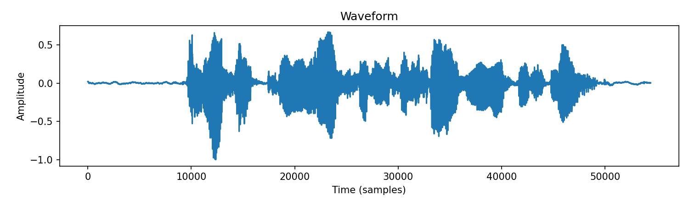

# AI_course

**Name:** Abbos Aliboev  (알리)
**ID:** [2023041080]  
**Course:** 2025-2 Artificial Intelligence  

## Development Environment

### Hardware
- GPU: NVIDIA TITAN RTX
- CUDA Support: Available (1 device)

### Software Stack
- Python: 3.10.x
- PyTorch: 2.5.1+cu124 (CUDA-enabled)
- Jupyter Notebook: Configured and operational

### Environment Status
- ✅ PyTorch successfully imported and functional
- ✅ CUDA acceleration available
- ✅ Tensor operations working correctly
- ✅ GPU-accelerated deep learning ready

## GPU Test Result

Below is the verification of PyTorch with CUDA on my device:

## Quick Environment Check
Run the code -> check_torch.py

# Week 3 - PyTorch Audio I/O

This week’s task is based on the official [PyTorch Audio I/O Tutorial](https://docs.pytorch.org/audio/stable/tutorials/audio_io_tutorial.html).

## ✅ What I did
- Downloaded example audio files using `torchaudio.utils.download_asset`
- Loaded audio with `torchaudio.load`
- Displayed **waveform** and **spectrogram** using `matplotlib`

## 📊 Results
Waveform:  

Spectrogram:  

## 📂 Files
- `audio_io_demo.py` → main code
- `waveform.png` → waveform plot
- `spectrogram.png` → spectrogram plot

---
