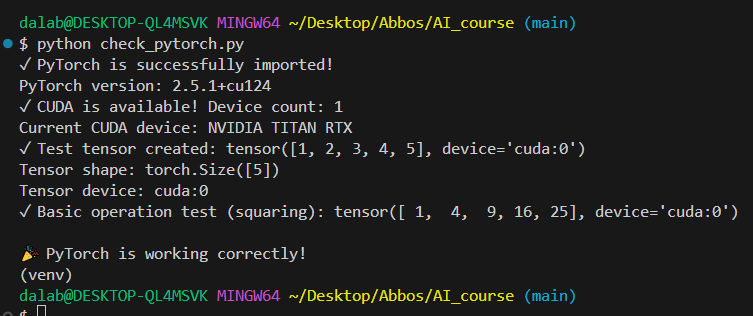

# AI_course

**Name:** Abbos Aliboev  (알리)
**ID:** [2023041080]  
**Course:** 2025-2 Artificial Intelligence  

## Development Environment

### Hardware
- GPU: NVIDIA TITAN RTX
- CUDA Support: Available (1 device)

### Software Stack
- Python: 3.10.x
- PyTorch: 2.5.1+cu124 (CUDA-enabled)
- Jupyter Notebook: Configured and operational

### Environment Status
- ✅ PyTorch successfully imported and functional
- ✅ CUDA acceleration available
- ✅ Tensor operations working correctly
- ✅ GPU-accelerated deep learning ready

## GPU Test Result

Below is the verification of PyTorch with CUDA on my device:

## Quick Environment Check
Run the code -> check_torch.py
