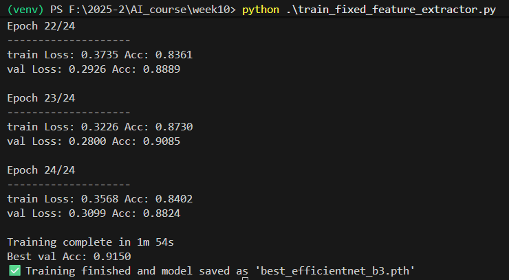
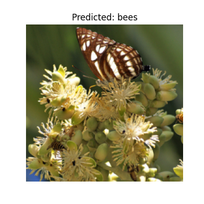

# 📁 Week 10 – Image Classification with Transfer Learning

This project performs **image classification** using **EfficientNet-B3** on the Hymenoptera dataset (bees vs ants) with PyTorch.  
The goal is to train a model using transfer learning and visualize predictions on validation images.

---

## Dataset

- Name: **Hymenoptera Data**  
- Source: [PyTorch Transfer Learning Tutorial](https://docs.pytorch.org/tutorials/beginner/transfer_learning_tutorial.html)  
- Structure:

```
data/
├── hymenoptera_data/
│ ├── train/
│ │ ├── ants/
│ │ └── bees/
│ └── val/
│ ├── ants/
│ └── bees/
```

- Classes: `ants`, `bees`  
- Train/Val split: 80% / 20%  

---

## Project Structure

```
├── train_fixed_feature_extractor.py # Model training script
├── prediction_fixed_feature.py # Inference script
├── best_efficientnet_b3.pth # Trained model weights
├── README.md # This file
├── data/ # Hymenoptera dataset
├── images/
│ ├── results.png # Training loss & accuracy log
│ └── Figure_1.png # Sample prediction on validation image
```

---


Results
### Training Log


### Sample Predictions


The model successfully differentiates between ants and bees in validation images.

Transfer learning with EfficientNet-B3 yields high accuracy with limited training data.
