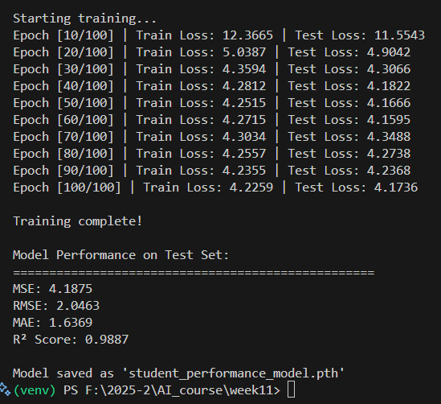
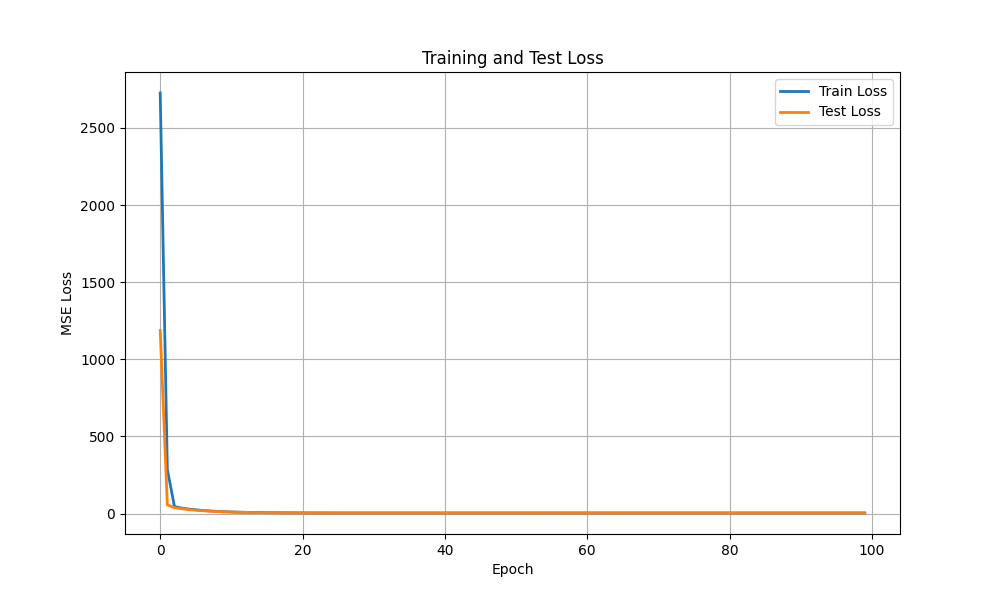
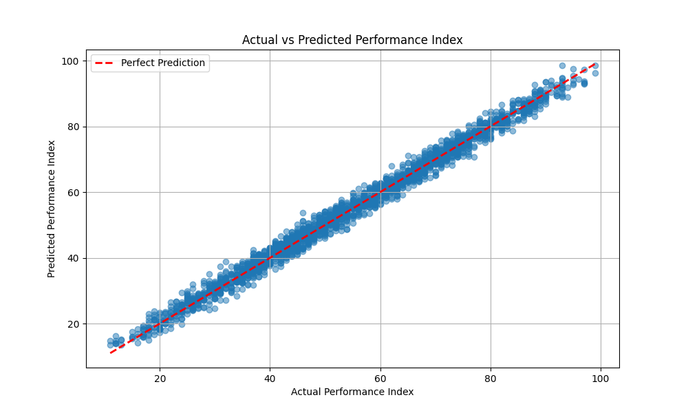

# 📁 Week 11 – LAB-Regression

This project performs regression analysis on a student performance dataset using **PyTorch**. The goal is to predict the **Performance Index** of students based on several features and achieve high regression accuracy.
---

## Dataset

- File: `Student_Performance.csv`  
- Number of samples: 10,000  
- Features: 5 numerical/categorical features  
- Target variable: `Performance Index`

---

## Project Structure

├── Student_Performance.csv # Dataset
├── train_model.py # Regression model training
├── student_performance_model.pth # Trained PyTorch model
├── README.md # Project description
├── images/
│ ├── eval1.png # Evaluation graph 1
│ ├── eval2.png # Evaluation graph 2
│ └── training_log.png # Training loss/log graph

---

## How to Run

1. Install dependencies:
```
pip install torch torchvision scikit-learn pandas matplotlib
```

Train the model (if not using the pre-trained model):
```
python train_model.py
```
The trained model will be saved as student_performance_model.pth.


## Results

### Training Log


### Evaluation 1


### Evaluation 2



Model Performance on Test Set:

MSE: <insert final value>

RMSE: <insert final value>

MAE: <insert final value>

R² Score: <insert final value>

Notes

Make sure the CSV file is in the same folder as train_model.py

The images folder contains evaluation and training graphs