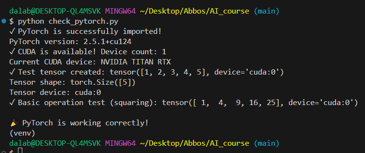

# Week 2 - PyTorch Environment Setup

This week’s task was to set up the development environment for PyTorch and verify GPU (CUDA) support.

## ✅ What I did
- Created a virtual environment (`venv`)
- Installed **PyTorch** with CUDA support
- Verified installation by running `check_torch.py`
- Confirmed that **CUDA acceleration** is available on my GPU
- Generated a test result image of PyTorch CUDA check

## 🖥️ Development Environment

### Hardware
- GPU: NVIDIA TITAN RTX
- CUDA Support: Available (1 device)

### Software Stack
- Python: 3.10.x
- PyTorch: 2.5.1+cu124 (CUDA-enabled)
- Jupyter Notebook: Configured and operational

### Environment Status
- ✅ PyTorch successfully imported and functional
- ✅ CUDA acceleration available
- ✅ Tensor operations working correctly
- ✅ GPU-accelerated deep learning ready

## 📊 Results

PyTorch CUDA Check:  

## 📂 Files
- `check_torch.py` → verification code  
- `images/pytorch_result.png` → screenshot of CUDA-enabled PyTorch test
