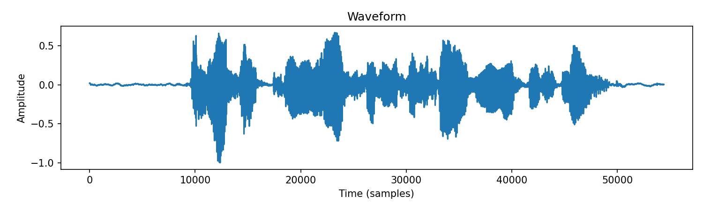
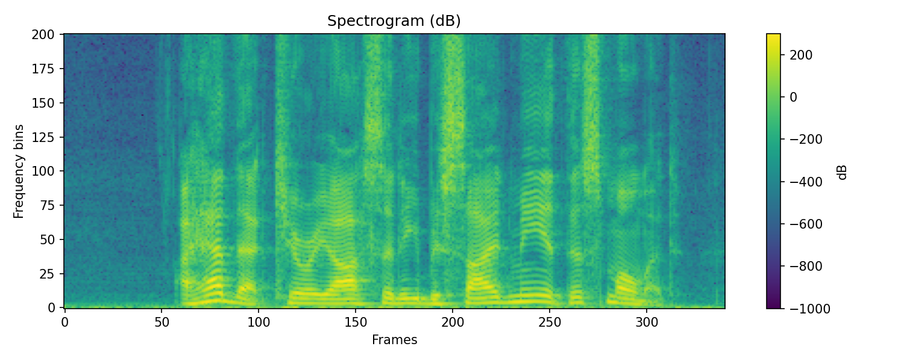

# Week 3 - PyTorch Audio I/O

This week’s task is based on the official [PyTorch Audio I/O Tutorial](https://docs.pytorch.org/audio/stable/tutorials/audio_io_tutorial.html).

## ✅ What I did
- Downloaded example audio files using `torchaudio.utils.download_asset`
- Loaded audio with `torchaudio.load`
- Visualized audio data:
  - **Waveform**
  - **Spectrogram**
- Used `matplotlib` for plotting and saving images

## 📊 Results
Waveform:  

Spectrogram:  

## 📂 Files
- `audio_io_demo.py` → main code
- `images/waveform.png` → waveform plot
- `images/spectrogram.png` → spectrogram plot
