# Week 4 – Audio Processing Homework

This repository contains my solutions for the **Week 4 Audio Processing assignment**.  
Dataset: sample audio files provided via LMS (`audio_dataset/` folder).  

---

## 📌 Tasks

1. **Waveform & Spectrogram Visualization**  
   - Load audio files and plot their raw waveform.  
   - Compute and display the basic spectrogram.  

2. **Downsampling & Upsampling**  
   - Resample audio from **16 kHz → 8 kHz** (downsampling).  
   - Resample back from **8 kHz → 16 kHz** (upsampling).  
   - Compare the shapes of waveforms before and after.  

3. **Feature Extraction**  
   - Extract advanced features using `torchaudio.transforms`:  
     - Spectrogram  
     - Mel-Spectrogram  
     - MFCC  
     - Mel Filter Bank  
     - LFCC  
     - Pitch  

---


---

## 🖼️ Results

### 1. Waveform & Spectrogram
For each audio file, we plotted both the **raw waveform** and the **spectrogram**.

- **095522039.m4a**
<p align="center">
  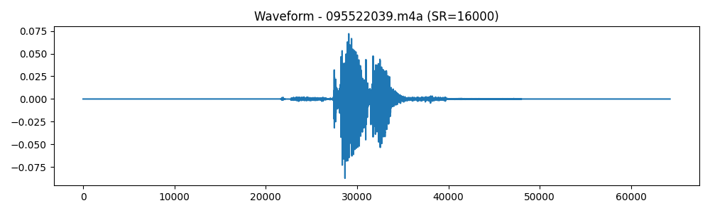
  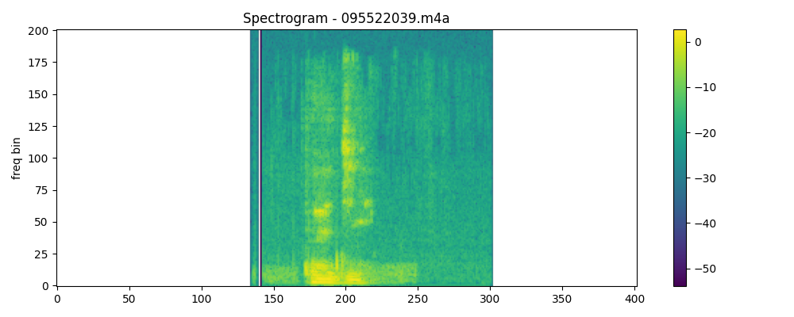
</p>

- **095522040.m4a**
<p align="center">
  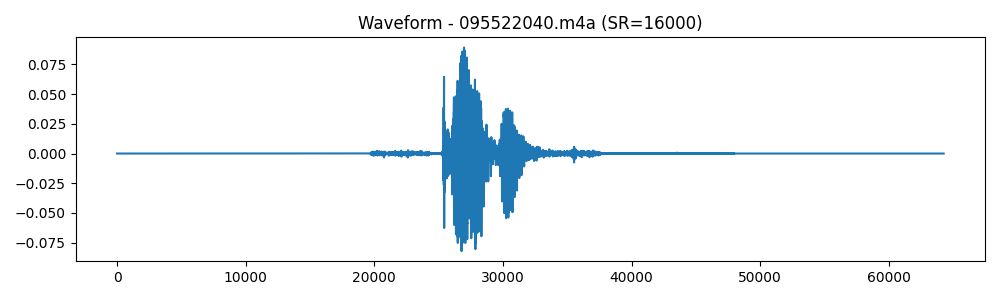
  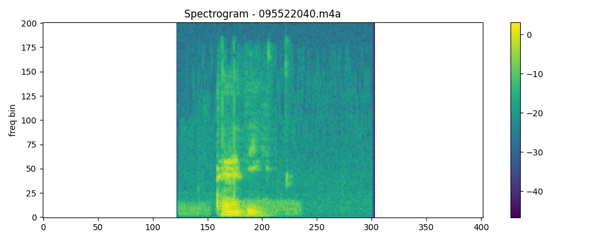
</p>

- **095522041.m4a**
<p align="center">
  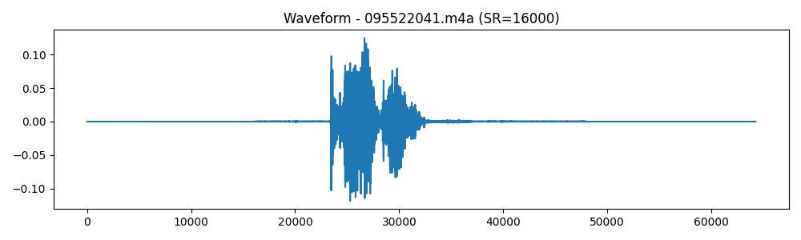
  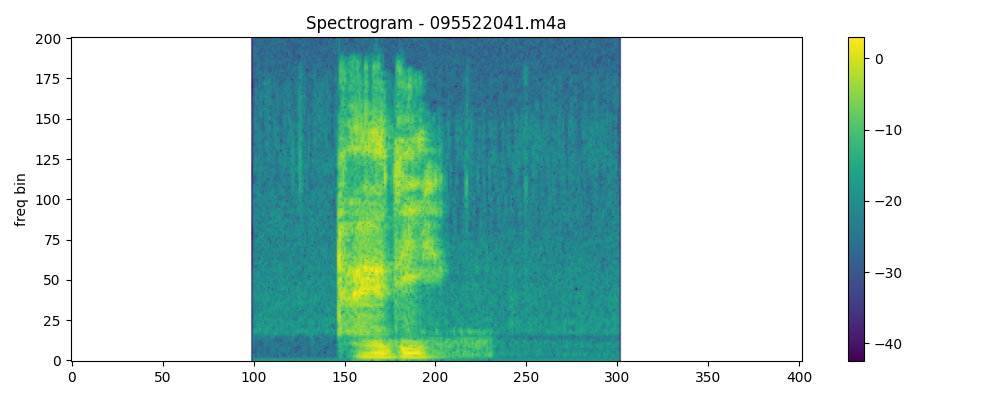
</p>

- **095522042.m4a**
<p align="center">
  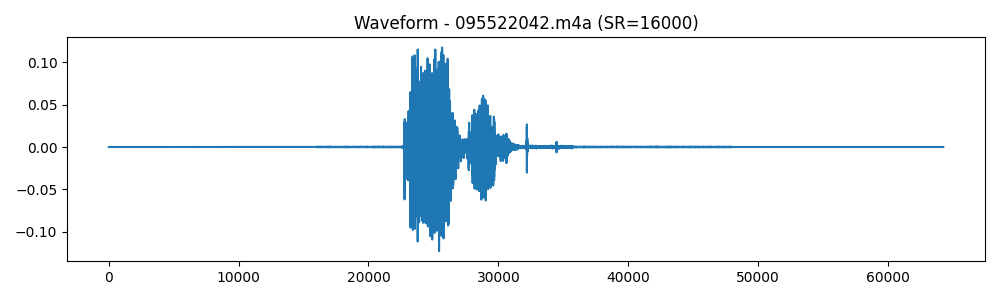
  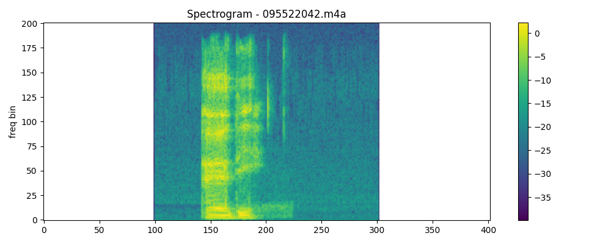
</p>

---

### 2. Resampling
All four audio files were successfully resampled:
- **Downsampled** from 16 kHz → 8 kHz  
- **Upsampled** back from 8 kHz → 16 kHz  

Result summary (shapes printed in console) is also visualized here:
<p align="center">
  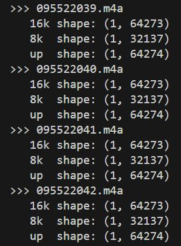
</p>

---

### 3. Feature Extraction

We extracted several important features for **all 4 audio files**. Below are representative plots:

#### Mel-Spectrogram
- **095522039.m4a** and **095522040.m4a**
<p align="center">
  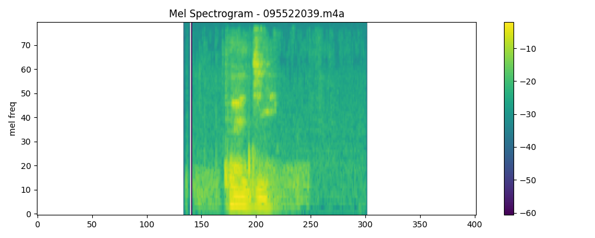
  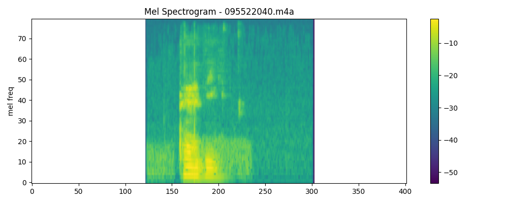
</p>

- **095522041.m4a** and **095522042.m4a**
<p align="center">
  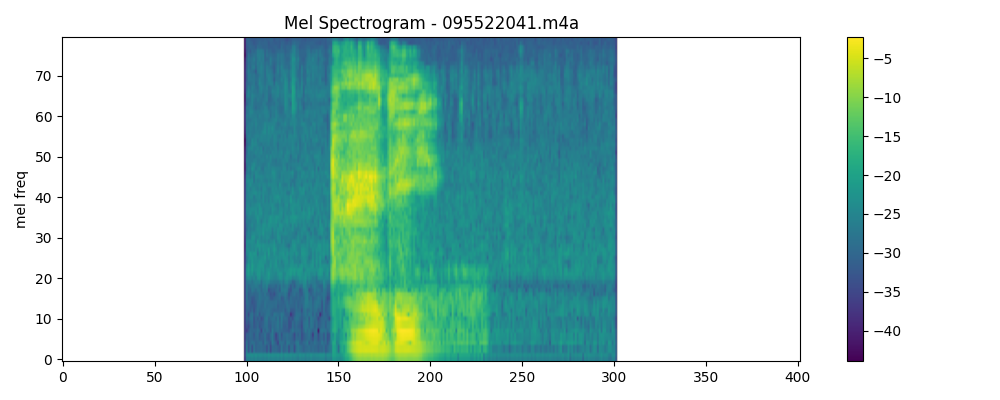
  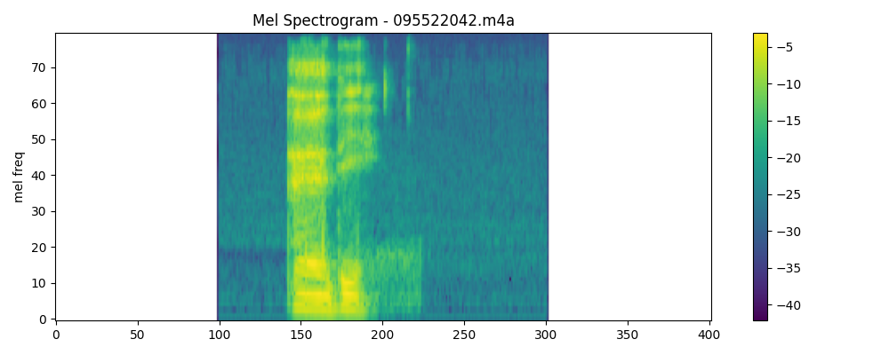
</p>

#### MFCC
- **095522039.m4a** and **095522040.m4a**
<p align="center">
  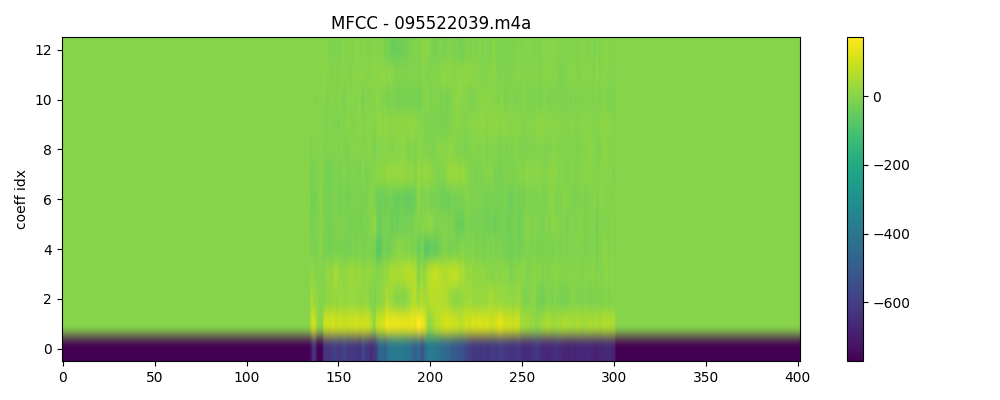
  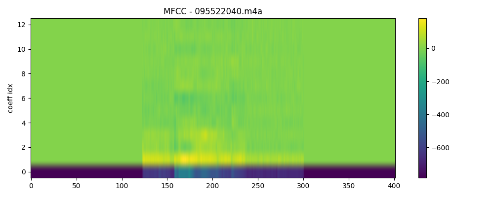
</p>

- **095522041.m4a** and **095522042.m4a**
<p align="center">
  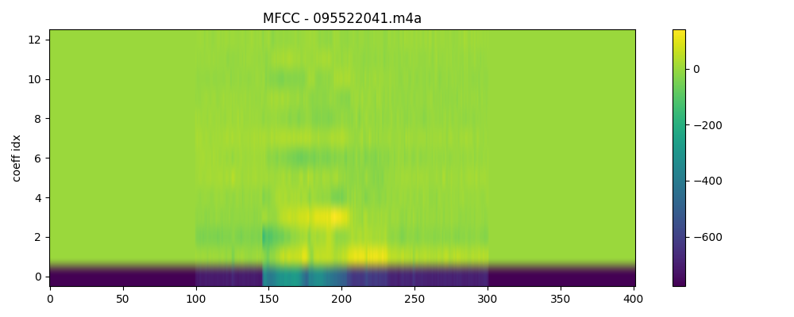
  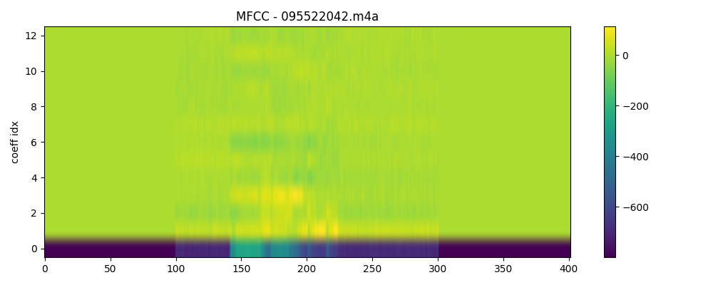
</p>

#### LFCC
- **095522039.m4a** and **095522040.m4a**
<p align="center">
  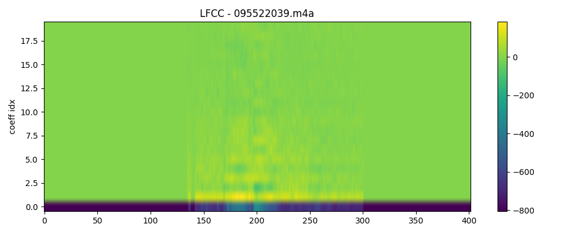
  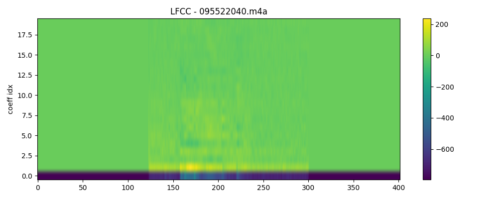
</p>

- **095522041.m4a** and **095522042.m4a**
<p align="center">
  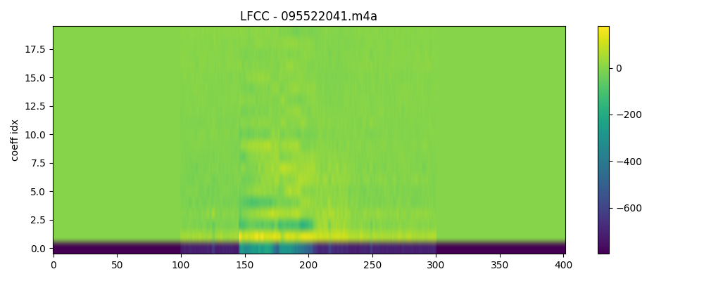
  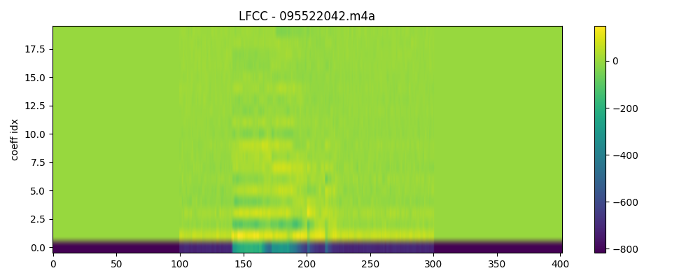
</p>

#### Mel Filter Bank
- **095522039.m4a** and **095522040.m4a**
<p align="center">
  
  
</p>

- **095522041.m4a** and **095522042.m4a**
<p align="center">
  
  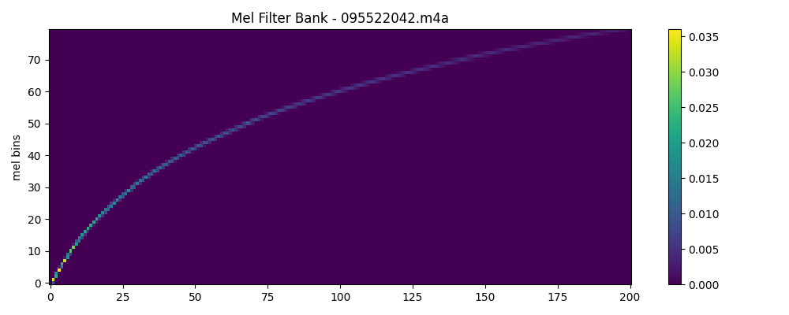
</p>

---

## 🚀 How to Run
1. Install requirements:
   ```
   pip install torch torchaudio matplotlib soundfile
   ```
2. Run scripts step by step:
```
python 1_waveform_spectrogram.py
python 2_resampling.py
python 3_features_extended.py
```

## ✅ Conclusion

Successfully visualized waveforms and spectrograms.

Performed downsampling (16k → 8k) and upsampling (8k → 16k).

Extracted multiple audio features: Spectrogram, Mel-Spectrogram, MFCC, LFCC, Pitch, and Mel Filter Banks.

Results are saved in the images/ folder and included in this README.