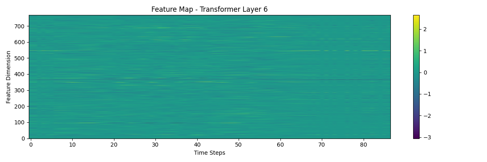
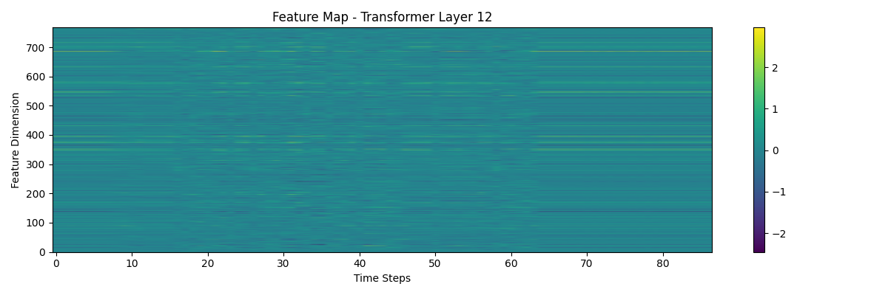
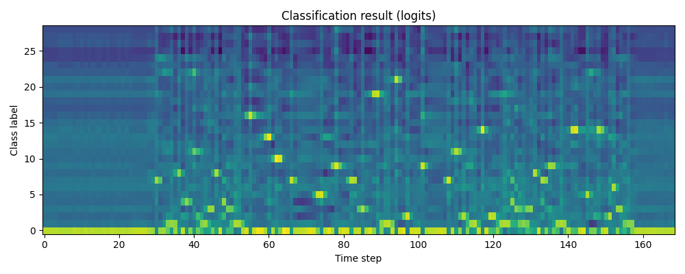
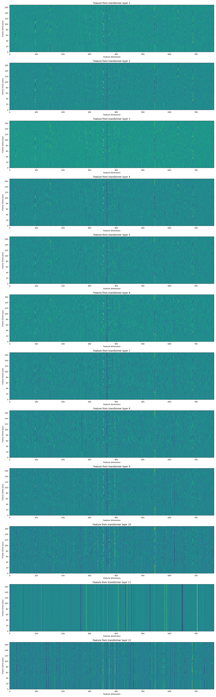
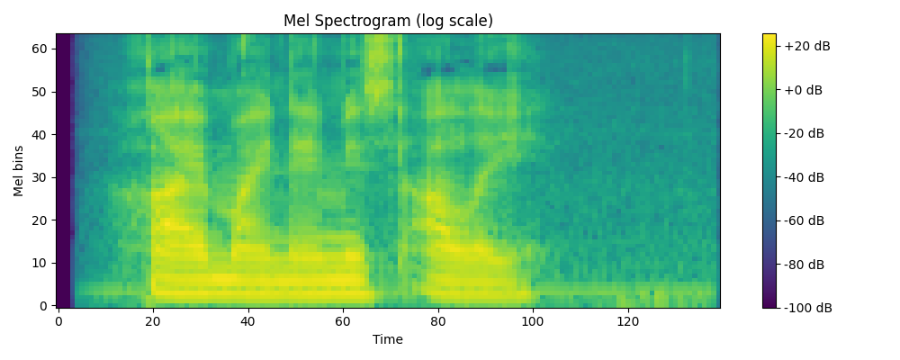

# 📁 Week 5 – Speech Recognition with Wav2Vec2

> 🔊 This week’s task was to perform **speech recognition using the Wav2Vec2 model** from [PyTorch torchaudio tutorial](https://pytorch.org/audio/stable/tutorials/speech_recognition_pipeline_tutorial.html), and apply it on both:
- the **given sample VOiCES audio**
- and a **custom English audio** file recorded by the student.

---

## ✅ Files and What They Do

| File | Description |
|------|-------------|
| `01_prepare.py` | Initial import, device, setup |
| `02_model.py` | Loads Wav2Vec2 model and bundle |
| `03_custom_audio.py` | Loads and transcribes `custom_audio_week5.wav` |
| `04_feature_experiment.py` | Visualizes Mel Spectrogram of custom audio |
| `05_plot_layers.py` | Extracts and saves 12 transformer layer feature maps |
| `full_tutorial.py` | Runs the **full official tutorial**, including VOiCES audio, all features, logits, and decoding |

---

## 🔉 Custom Audio Used

- File: `audio_dataset/custom_audio_week5.wav`  
- Format: WAV, 16kHz, mono  
- Content: _"Hi, my name is Ali"_ (or similar)

---

## 🖼️ Results

### ✅ Transformer Feature Layers (custom audio)

| Layer | Image |
|-------|-------|
| Layer 1 |  |
| Layer 6 |  |
| Layer 12 |  |

📁 All layers saved as: `custom_feat_layer_01.png` to `custom_feat_layer_12.png`

---

### ✅ Classification Logits (tutorial audio)

---

### ✅ All Tutorial Layers (official VOiCES sample)

---

## 📜 Transcript Output

- On sample audio:

I|HAD|THAT|CURIOSITY|BESIDE|ME|AT|THIS|MOMENT

- On custom audio:

HI|MY|NAME|IS|ALI

---

## 🧩 Additional Experiment: Mel Spectrogram

---

## 🧾 Notes

- Models used: `torchaudio.pipelines.WAV2VEC2_ASR_BASE_960H`
- All scripts are runnable individually.
- Figures auto-save when scripts are run.
- Audio was prepared manually and placed in `audio_dataset/`.

---

✅ **Prepared by:** Abbos Aliboev  
🧠 Course: AI (Speech Recognition Week)

