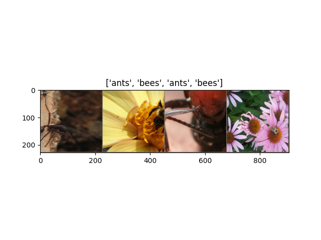
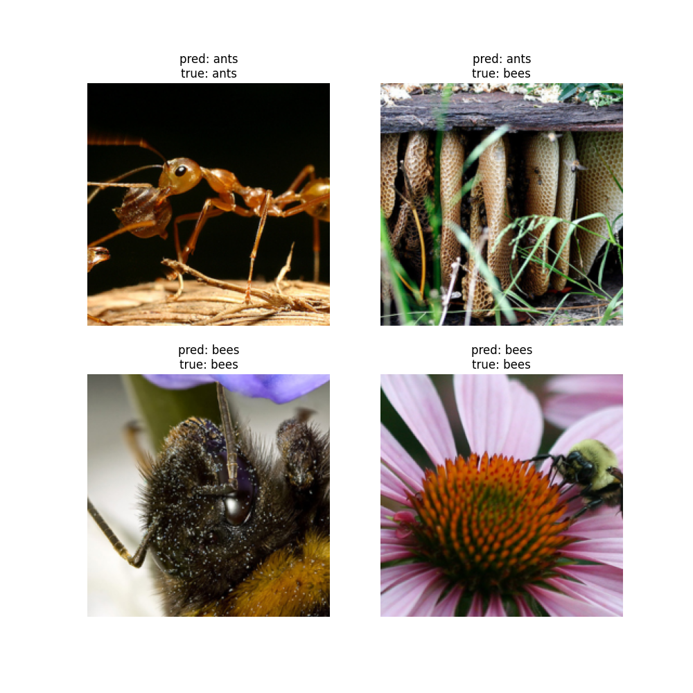

# PyTorch Transfer Learning Practice

This repository contains a hands-on practice of **transfer learning using PyTorch**, based on the official PyTorch tutorial: [Transfer Learning for Computer Vision Tutorial](https://docs.pytorch.org/tutorials/beginner/transfer_learning_tutorial.html).

## Project Overview

The goal of this practice is to:

- Load and preprocess an image dataset (`hymenoptera_data` — ants vs. bees)
- Visualize sample images
- Build a pretrained **ResNet18** model for transfer learning
- Train the model on the dataset
- Evaluate the model and visualize predictions

All outputs, including sample images and prediction results, are saved in the `images/` folder.

---

## Project Structure
```
week7/
├── data/ # Dataset folder (hymenoptera_data)
├── images/ # Saved visualizations (Figure_1.png, Figure_2.png)
├── 1_setup.py # Pretrained ResNet18 model setup
├── 2_visualize_data.py # Visualize dataset samples
├── 3_model_setup.py # Model, optimizer, and scheduler setup
├── 4_train_transfer_learning.py # Training loop and model saving
├── 5_visualize_predictions.py # Visualize predictions of the trained model
├── best_resnet18.pth # Trained model weights
└── README.md # Project documentation
```

---

## Requirements

- Python 3.8+  
- PyTorch 2.x  
- torchvision  
- matplotlib  
- numpy  

Install required packages via:
```bash
pip install torch torchvision matplotlib numpy
```

---

## How to Run

### 1. Data Visualization
```bash
python 3_visualize_data.py
```

`Figure_1.png` will be saved in the `images/` folder.

### 2. Model Setup and Training
```bash
python model_setup.py
python 5_train_model.py
```

Trained model will be saved as `best_resnet18.pth`.

### 3. Prediction Visualization
```bash
python visualize_predictions.py
```

Prediction results will be saved as `Figure_2.png` in `images/`.

---

## Results

**Best validation accuracy achieved:** 94.12%

### Sample Dataset Visualization



*Sample images from the training dataset showing ants and bees*

### Prediction Visualization



*Model predictions on test images with predicted class labels*

---

## Implementation Notes

- The project is implemented to be **Windows-compatible**, using `if __name__ == "__main__"` to avoid multiprocessing errors.
- Data is normalized using **ImageNet mean and standard deviation** for transfer learning.
- For training on other datasets (homework), update the `data_dir` path and number of classes accordingly.

---

## Next Steps

- Apply the same workflow on a new dataset for the homework assignment
- Compare performance and visualize predictions for the new dataset
- Save and include prediction images in `images/` for reporting

---

## References

- [PyTorch Transfer Learning Tutorial](https://docs.pytorch.org/tutorials/beginner/transfer_learning_tutorial.html)
- [ResNet Paper](https://arxiv.org/abs/1512.03385)

---

## License

This project is for educational purposes.