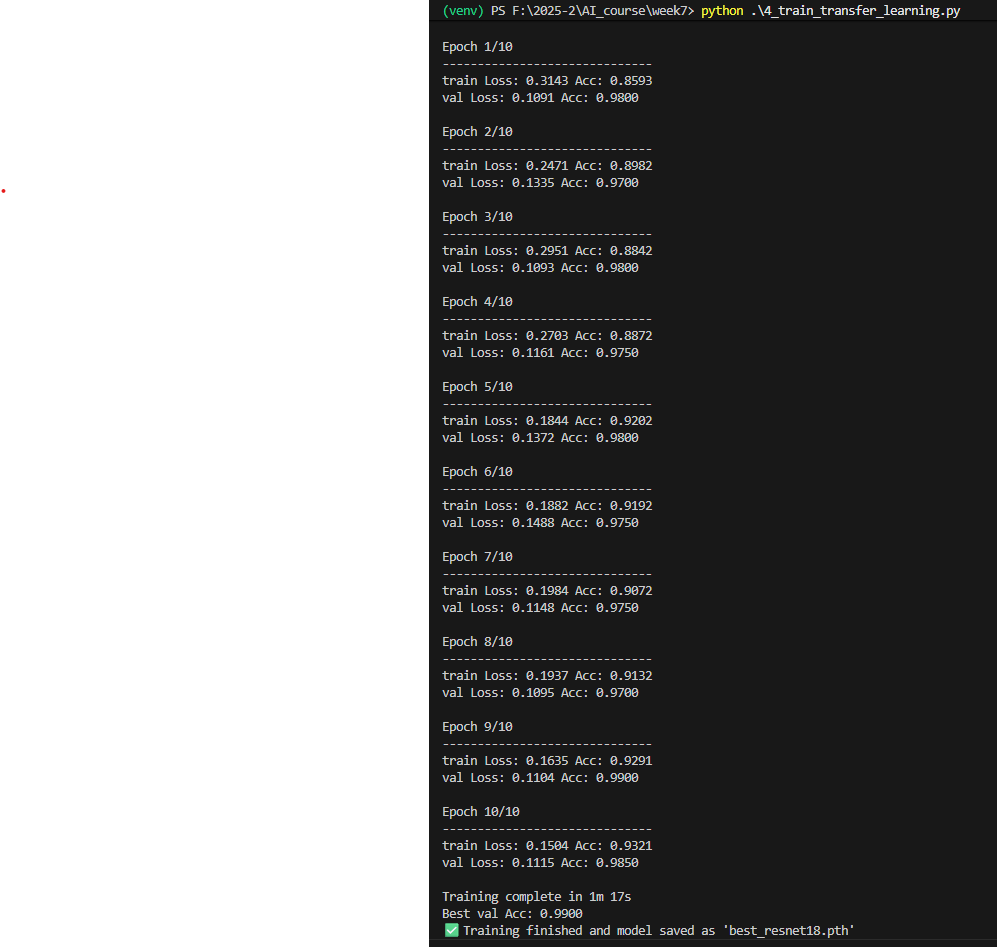
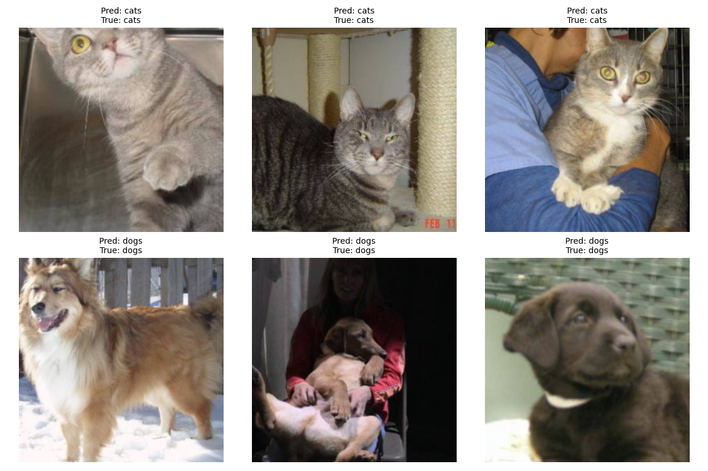

# 📁 Week 5 – PyTorch Transfer Learning 

This repository contains a hands-on practice and homework of **transfer learning using PyTorch**.

## Project Overview

The goal of this practice is to:

- Load and preprocess an image dataset (`sample_computer_vision` — cats vs. dogs)
- Visualize sample images
- Build a pretrained **ResNet18** model for transfer learning
- Train the model on the dataset
- Evaluate the model and visualize predictions

All outputs, including sample images and prediction results, are saved in the `images/` folder.

---

## Project Structure
```
week7/
├── data/                        # Dataset folder (hymenoptera_data)
├── images/                      # Saved visualizations (Figure_1.png, Figure_2.png)
├── 1_setup.py                   # Pretrained ResNet18 model setup
├── 2_visualize_data.py          # Visualize dataset samples
├── 3_model_setup.py             # Model, optimizer, and scheduler setup
├── 4_train_transfer_learning.py # Training loop and model saving
├── 5_visualize_predictions.py   # Visualize predictions of the trained model
├── best_resnet18.pth            # Trained model weights
└── README.md                    # Project documentation
```


---

## Results




### Sample Dataset Visualization


*Sample images from the training dataset showing cats and dogs*

### Prediction Visualization



*Model predictions on test images with predicted class labels*

---

## References

- [PyTorch Transfer Learning Tutorial](https://docs.pytorch.org/tutorials/beginner/transfer_learning_tutorial.html)
- [ResNet Paper](https://arxiv.org/abs/1512.03385)

---

## License

This project is for educational purposes.